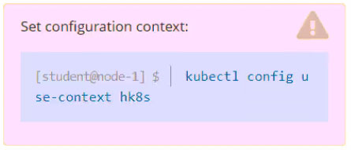

# Question 11

Task
Create a persistent volume with name app-data, of capacity 2Gi and access mode ReadOnlyMany. The type of volume is hostPath and its location is /srv/app-
data.

Read from this doc
- https://kubernetes.io/docs/concepts/storage/persistent-volumes/
- https://kubernetes.io/docs/tasks/configure-pod-container/configure-persistent-volume-storage/

