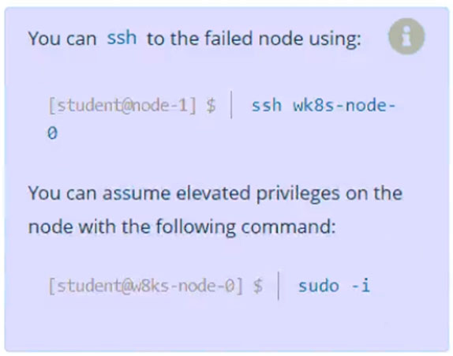
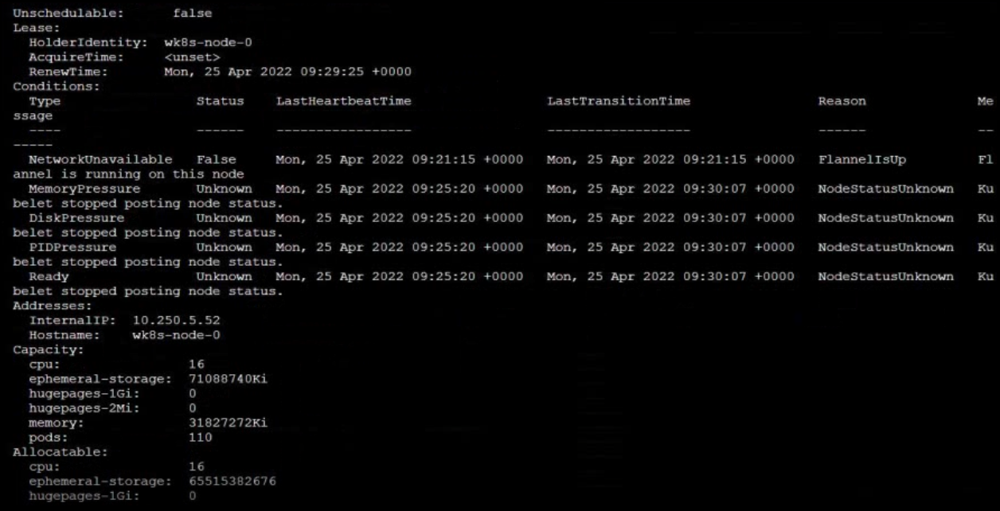

# Question 15

Task
A Kubernetes worker node, named wk8s-node-0 is in state NotReady.
Investigate why this is the case, and perform any appropriate steps to bring the node to a Ready state, ensuring that any changes are made permanent.

