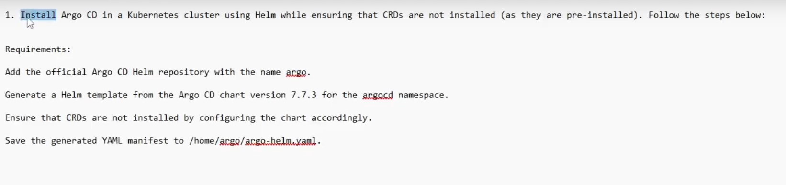

# Argocd
Install Argo Co in a kubernetes cluster using helm while ensuring that thus are not installed (as they are pre-installed). Follow the steps below.

Requirements:
Add the official Argo CD Helm repository with the name argo.
Generate a Helm template from the Argo CD chart version 7.7.3 for the argocd namespace
Ensure that CRDs are not installed by configuring the chart accordingly.
Save the generated YAML manifest to /home/argo/argo-helm.yaml.

### Answer

helm repo add argo https://argoproj.github.io/argo-helm
helm repo pull

helm pull argo/argo-cd --version 7.7.3
tar -zxvf argo-cd-7.7.3.tgz

// Edit the values files, disable crds.install -> false
cd argo-cd/

helm template . > /home/argo/argo-helm.yaml

