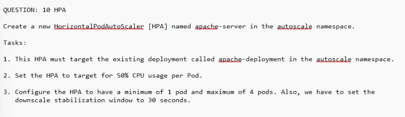

QUESTION: 10 HPA
Create a new HorizontalPodAutoScaler [HPA] named apache-server in the autoscale namespace.

Tasks:
1. This HPA must target the existing deployment called apache-deployment in the autoscale namespace.
2. Set the HPA to target for 50% CPU usage per Pod.
3. Configure the HPA to have a minimum of 1 pod and maximum of 4 pods. Also, we have to set the downscale stabilization window to 30 seconds.


```bash

kubectl autoscale deployment apache-server -n autoscale --cpu-percent=50 --min=1 --max=4 --horizontal-pod-autoscaler-downscale-stabilization=60


```

apiVersion: autoscaling/v2
kind: HorizontalPodAutoscaler
metadata:
  creationTimestamp: "2025-10-22T13:39:54Z"
  name: busybox-logger
  namespace: fubar
  resourceVersion: "1054203"
  uid: c5b586b7-bdf4-446c-be7e-db2675890f08
spec:
  maxReplicas: 4
  metrics:
  - resource:
      name: cpu
      target:
        averageUtilization: 50
        type: Utilization
    type: Resource
  minReplicas: 1
  scaleTargetRef:
    apiVersion: apps/v1
    kind: Deployment
    name: busybox-logger
  behavior:
    scaleDown:
        stabilizationWindowSeconds: 30
status:
  conditions:
  - lastTransitionTime: "2025-10-22T13:40:09Z"
    message: the HPA controller was able to get the target's current scale
    reason: SucceededGetScale
    status: "True"
    type: AbleToScale
  - lastTransitionTime: "2025-10-22T13:40:09Z"
    message: 'the HPA was unable to compute the replica count: failed to get cpu utilization:
      missing request for cpu in container nginx of Pod busybox-logger-647677fc66-9kdds'
    reason: FailedGetResourceMetric
    status: "False"
    type: ScalingActive
  currentMetrics:
  - type: ""
  currentReplicas: 1
  desiredReplicas: 0