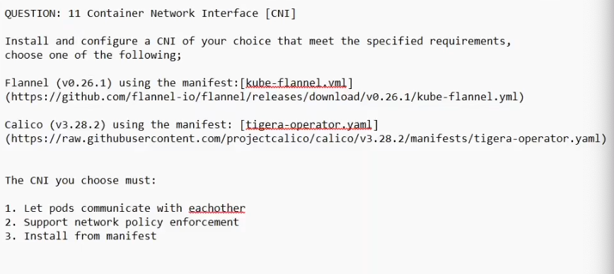

QUESTION: 11 Container Network Interface [CNI]
Install and configure a CNI of your choice that meet the specified requirements,
choose one of the following;
Flannel (v0.26.1) using the manifest: [kube-flannel.vml] (https://github.com/flannel-io/flannel/releases/download/v0.26.1/kube-flannel.yml)
Calico (v3.28.2) using the manifest: [tigera-operator.yaml] (https://raw.githubusercontent.com/projectcalico/calico/v3.28.2/manifests/tigera-operator.yaml)
The CNI you choose must:
1. Let pods communicate with eachother
2. Support network policy enforcement
3. Install from manifest

Will choose Calico due to network policy enforcement

curl -sL https://github.com/flannel-io/flannel/releases/download/v0.26.1/kube-flannel.yml | grep network
// this flannel does not have network enforce ment

curl -sL https://raw.githubusercontent.com/projectcalico/calico/v3.28.2/manifests/tigera-operator.yaml | grep network

kubectl create -f https://raw.githubusercontent.com/projectcalico/calico/v3.28.2/manifests/tigera-operator.yaml
kubectl replace -f https://raw.githubusercontent.com/projectcalico/calico/v3.28.2/manifests/tigera-operator.yaml