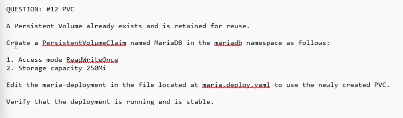

QUESTION: #12 PVC
A Persistent Volume already exists and is retained for reuse.
Create a PecsistentVeluneClaim named MariaDB in the mariade namespace as follows:
1. Access mode ReadWriteOnce
2. Storage capacity 250Mi
Edit the maria-deployment in the file located at macia deploy xam to use the newly created PVC.
Verify that the deployment is running and is stable.


apiVersion: v1
kind: PersistentVolumeClaim
metadata:
  name: mariadb
  namespace: mariadb
spec:
  storageClassName: manual
  accessModes:
    - ReadWriteOnce
  resources:
    requests:
      storage: 250Mi

# sample deployment below
```
apiVersion: v1
items:
- apiVersion: apps/v1
  kind: Deployment
  metadata:
    annotations:
      deployment.kubernetes.io/revision: "2"
      kubectl.kubernetes.io/last-applied-configuration: |
        {"apiVersion":"apps/v1","kind":"Deployment","metadata":{"annotations":{},"labels":{"app":"nginx"},"name":"busybox-logger","namespace":"fubar"},"spec":{"replicas":1,"selector":{"matchLabels":{"app":"nginx"}},"template":{"metadata":{"labels":{"app":"nginx"}},"spec":{"containers":[{"image":"nginx:1.14.2","name":"nginx","ports":[{"containerPort":80}]}]}}}}
    creationTimestamp: "2025-10-21T13:25:08Z"
    generation: 2
    labels:
      app: nginx
    name: busybox-logger
    namespace: fubar
    resourceVersion: "1019047"
    uid: f888d18a-d5f0-4855-ac19-b5281996f8d9
  spec:
    progressDeadlineSeconds: 600
    replicas: 1
    revisionHistoryLimit: 10
    selector:
      matchLabels:
        app: nginx
    strategy:
      rollingUpdate:
        maxSurge: 25%
        maxUnavailable: 25%
      type: RollingUpdate
    template:
      metadata:
        creationTimestamp: null
        labels:
          app: nginx
      spec:
        containers:
        - image: nginx:1.14.2
          imagePullPolicy: IfNotPresent
          name: nginx
          volumes:
            - name: maria-pv-storage
              persistentVolumeClaim:
                claimName: mariadb
          ports:
          - containerPort: 80
            protocol: TCP
          resources: {}
          terminationMessagePath: /dev/termination-log
          terminationMessagePolicy: File
        volumeMounts:
          - mounthPath: '/usr/share/'
            name: maria-pv-storage
        dnsPolicy: ClusterFirst
        priorityClassName: high-priority
        restartPolicy: Always
        schedulerName: default-scheduler
        securityContext: {}
        terminationGracePeriodSeconds: 30
  status:
    availableReplicas: 1
    conditions:
    - lastTransitionTime: "2025-10-21T13:25:09Z"
      lastUpdateTime: "2025-10-21T13:25:09Z"
      message: Deployment has minimum availability.
      reason: MinimumReplicasAvailable
      status: "True"
      type: Available
    - lastTransitionTime: "2025-10-21T13:25:36Z"
      lastUpdateTime: "2025-10-21T13:25:36Z"
      message: 'pods "busybox-logger-6b79f58d5f-" is forbidden: no PriorityClass with
        name high-priority was found'
      reason: FailedCreate
      status: "True"
      type: ReplicaFailure
    - lastTransitionTime: "2025-10-21T13:35:37Z"
      lastUpdateTime: "2025-10-21T13:35:37Z"
      message: ReplicaSet "busybox-logger-6b79f58d5f" has timed out progressing.
      reason: ProgressDeadlineExceeded
      status: "False"
      type: Progressing
    observedGeneration: 2
    readyReplicas: 1
    replicas: 1
    unavailableReplicas: 1
kind: List
metadata:
  resourceVersion: ""
```