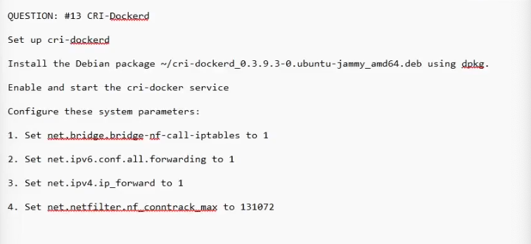

QUESTION: #13 CRI-Rocked
Set up cri-dockerd
Install the Debian package ~/cri-dockerd_0.3.9.3-0.ubuntu-jammy_amd64.deb using dpkg.
Enable and start the cri-docker service
Configure these system parameters:
1. Set net.bridge bridge-nf-call-iptables to 1
2. Set net.ipv6.conf.all.forwarding to 1
3. Set net.ipv4.ip_forward to 1
4. Set net.netfilter.nf_conntrack.max to 131072

```
wget https://github.com/Mirantis/cri-dockerd/releases/download/v0.3.9/cri-dockerd_0.3.9.3-0.ubuntu-jammy_amd64.deb

dkpg -i cri-dockerd_0.3.9.3-0.ubuntu-jammy_amd64.deb

# Follow this guide
https://mirantis.github.io/cri-dockerd/usage/install-manually/#setup-the-systemd-service


systemctl enable --now cri-docker.service
systemctl start cri-docker
systemctl status cri-docker

# in exam, do on the file they give you

vim /etc/sysctl.d/cka.conf

net.bridge bridge-nf-call-iptables=1
net.ipv6.conf.all.forwarding=1
net.ipv4.ip_forward=1
net.netfilter.nf_conntrack.max=131072

# to verify
sudo sysctl --system or sudo sysctl -a
sysctl net.bridge bridge-nf-call-iptables
```
