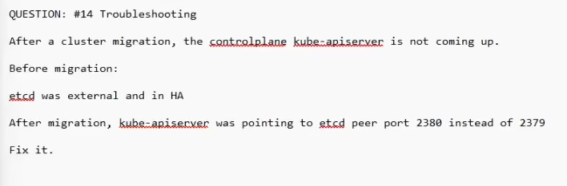

QUESTION:
#14 Troubleshooting
After
a cluster migration, the contcalelane kube-arisecker is not coming up.
Before migration:
etcd was external and in HA
After migration, kube-apiserver was pointing to etcd peer port 2380 instead of 2379
Fix it.

```
# look at https://kubernetes.io/docs/reference/command-line-tools-reference/kube-apiserver/
--etcd-servers

# in the control plane
kubectl get nodes
-> connections to the server was refused

crictl ps | grep kube-apiserver
-> returns empty
crictl ps | grep kube-apiserver
-> Try again and kube-apiserver will appear

cd /var/log/pods/kube-system_kube-api-controlplane/
cat 4.logs

cd /etc/kubernetes/manifest
vim kube-apiserver.yaml

# edit the --etcd-servers argument to the right pod
# wait a while 
kubectl get nodes
```
