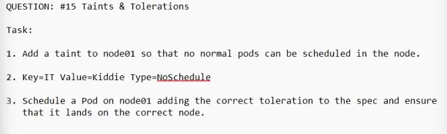

QUESTION: #15 Taints & Tolerations
Task:

1. Add a taint to node01 so that no normal pods can be scheduled in the node.

2. Key=IT Value=Kiddie Type=Neschedule

3. Schedule a Pod on node01 adding the correct toleration to the spec and ensure that it lands on the correct node.


kubectl taint node node01 IT=Kiddie:NoSchedule

kubectl run nginx --image=nginx --dry-run=client -o yaml > pod.yaml
```
apiVersion: v1
kind: Pod
metadata:
  creationTimestamp: null
  labels:
    run: nginx
  name: nginx
spec:
  containers:
  - image: nginx
    name: nginx
    resources: {}
  dnsPolicy: ClusterFirst
  restartPolicy: Always
  tolerations:
  - key: IT
    value: Kiddie
    effect: NoSchedule
    operator: "Equal"
    
status: {}
```