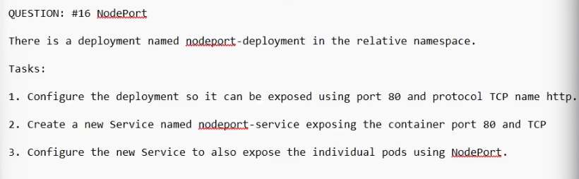

QUESTION: #16 NodePort

There is a deployment named nodeport-deployment in the relative namespace.
Tasks:

1. Configure the deployment so it can be exposed using port 80 and protocol TCP name http.

2. Create a new Service named nodeport-service exposing the container port 80 and TCP

3. Configure the new Service to also expose the individual pods using NodePort.

```

kubectl get deployment -n relative

# Add in the following

containers:
  - image: nginx
    imagePullPolicy: Always
    name: nginx
    ports:
    - containerPort: 80
      name: http
      protocol: TCP

kubectl expose deployment nodeport-service --port=80 --target-port=http --protocol=TCP --type=NodePort -n relative

curl http://<internal-ip>:31117

```