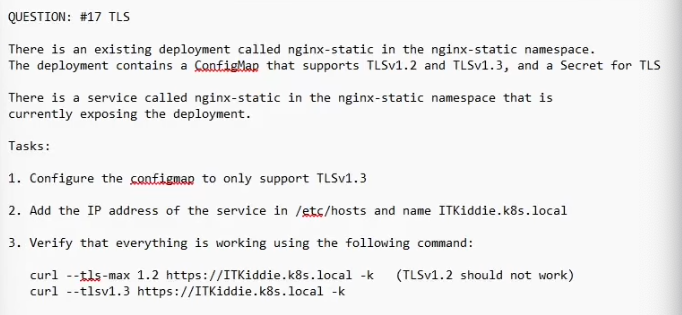

QUESTION: #17 TLS
There is an existing deployment called nginx-static in the nginx-static namespace.
The deployment contains a ConfigMap that supports TLSv1.2 and TLSv1.3, and a Secret for TLS
There is a service called nginx-static in the nginx-static namespace that is currently exposing the deployment.
Tasks:
1. Configure the configmap to only support TLSv1.3
2. Add the IP address of the service in /etc/hosts and name ITKiddie.k8s.local
3. Verify that everything is working using the following command:
curl --ls-max 1.2 https://ITKiddie.k8s.local -k (TLSv1.2 should not work)
curl --tlsv1.3 https://ITKiddie.k8s.local -k

```
kubectl get deployment nginx-static -n nginx-static
kubectl get cm
kubectl get secret


kubectl get cm nginx-config -n nginx-static -o yaml > nginx-config.yaml

vim nginx-config.yaml
# delete the TLSv1.2

kubectl apply -f nginx-config.yaml
kubectl get deployments
kubectl rollout restart deployments nginx-static

kubectl get nodes -o wide
<obtain the cluster ip>

vim /etc/hosts
10.100.46.136 ITKiddie.k8s.local

nslookup ITKiddie.k8s.local
curl --ls-max 1.2 https://ITKiddie.k8s.local 
curl --tlsv1.3 https://ITKiddie.k8s.local -k

# If both TLS works, need to delete existing deployment and recreate
kubectl get deployment nginx-static -o yaml > deploy.yaml
kubectl delete deployment nginx-static
kubectl apply -f deploy.yaml
```