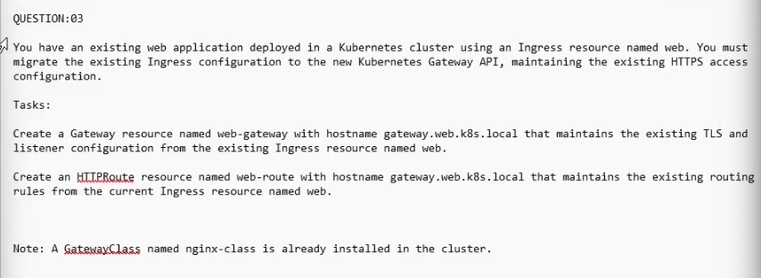
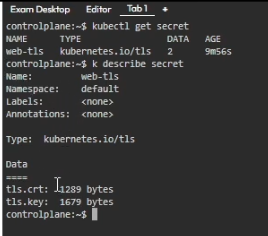
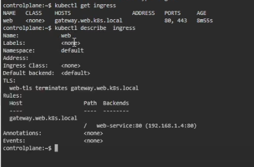

https://www.youtube.com/watch?v=W-Rt_U8any4&list=PLkDZsCgo3Isr4NB5cmyqG7OZwYEx5XOjM&index=15

### Answer

kubectl get secret

kubectl get ingress 

kubectl get gatewayclass

```
apiVersion: gateway.networking.k8s.io/v1
kind: GatewayClass
metadata:
  name: nginx-class
spec:
  controllerName: example.com/gateway-controller
```

#### Create a gateway resource
```
apiVersion: gateway.networking.k8s.io/v1
kind: Gateway
metadata:
  name: web-gateway
spec:
  gatewayClassName: nginx-class
  listeners:
  - name: https
    protocol: HTTPS
    port: 443
    hostname: gateway.web.k8s.local
    tls:
      mode: Terminate
      certificateRefs:
        - kind: Secret
          group: ""
          name: web-tls
```

#### Create a HTTPRoute resource
```
apiVersion: gateway.networking.k8s.io/v1
kind: HTTPRoute
metadata:
  name: web-route
spec:
  parentRefs:
  - name: web-gateway
  hostnames:
  - "gateway.web.k8s.local"
  rules:
  - matches:
    - path:
        type: PathPrefix
        value: /
    backendRefs:
    - name: web-service
      port: 80
```

#### Verify

kubectl get gateway
kubectl get httproute
