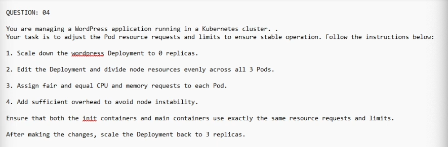
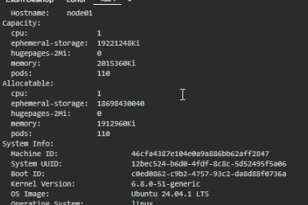

### Answer

kubectl scale deployment wordpress --replicas=0
kubectl get pods
kubectl get nodes
kubectl describe nodes node01

- 1 cpu
- 1912960 Ki

```
expr 1912960 / 1024 
1868 (Mi)
```
- take note of corends memory requested
1868 - 2(50) = 1768

10% buffer
expr "1768 * 0.9" | bc 
1591.2

expr 1591.2 / 3
530

request 500Mi (round down)
limit 550Mi // check by 550Mi x 3 must be less than 1768


CPU - 1Gi
// - away coreDNS
1 - 2 (50) - 25 = 875Mi 

expr "875Mi * 0.9" | bc
787.5

expr "787 / 3" | bc
262

request cpu 250 (Round Down)
limit cpu 290 Mi //  875 Mi / 3 = 291

kubectl edit deployment wordpress
- adjust the request and limits

kubectl scale deployment wordpress --replicas=3
