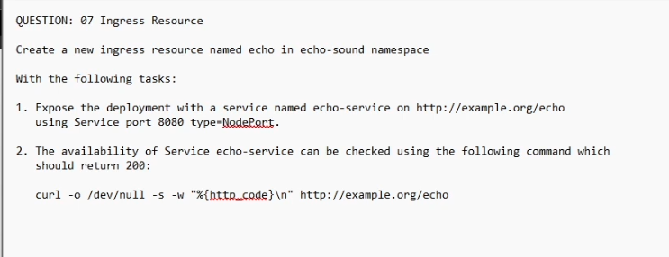

QUESTION: 07 Ingress Resource
Create a new ingress resource named echo in echo-sound namespace
With the following tasks:
1. Expose the deployment with a service named echo-service on http://example.org/echo
using Service port 8080 type-NodePort.
2. The availability of Service echo-service can be checked using the following command which
should return 200:
curl -o /dev/null -s -w "%{http.code}\n" http://example.org/echo

kubectl expose deployment echoserver-deployment -n echo-sound --type=NodePort --name=echo-service --port=8080 --target-port=8080

kubectl create ingress echo -n echo-sound --rule "example.org/echo=echo-service:8080"

apiVersion: networking.k8s.io/v1
kind: Ingress
metadata:
  creationTimestamp: "2025-10-21T14:27:09Z"
  generation: 1
  name: echo
  namespace: echo-sound
  resourceVersion: "1020023"
  uid: e5ece692-a723-47b1-89c4-618cb90faf12
spec:
  rules:
  - host: example.org
    http:
      paths:
      - backend:
          service:
            name: echo-service
            port:
              number: 8080
        path: /echo
        pathType: Exact
status:
  loadBalancer: {}

kubectl get svc # get the nodeport here
kubectl get nodes # get the node IP here

curl -o /dev/null -s -w "%{http.code}\n" http://example.org/echo
to change to
curl -o /dev/null -s -w "%{http.code}\n" -H "Host: example.org" http://${NODE_IP}:${NODE_PORT}/echo