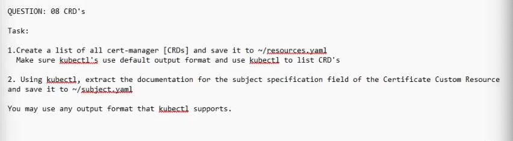

QUESTION: 08 CRD's
Task:
1. Create a list of all cert-manager [CRDs] and save it to ~/resources.vaml
Make sure kubectl's use default output format and use kubectl to list CRD's
2. Using kubestl, extract the documentation for the subject specification field of the Certificate Custom Resource and save it to ~/subject.vaml
You may use any output format that kubectl supports.

kubectl get crds | grep cert-manager > ~/resources.yaml

kubectl explain <crd>.x.y.z > ~/subject.yaml

kubectl explain certificates.spec.subject > ~/subject.yaml

