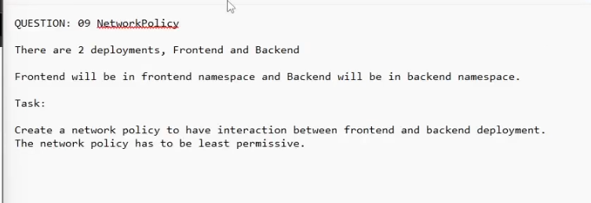

QUESTION: 09 NetworkPedicx
There
are
2 deployments, Frontend and Backend
Frontend will be in frontend namespace and Backend will be in backend namespace.
Task:
Create a network policy to have interaction between frontend and backend deployment.
The network policy has to be least permissive.

Look at the namespace, see if the namespace is being labelled
kubectl get ns
kubectl label ns frontend namespace=frontend

Look at the deployment first, see if the pod template has labels
such as
app=Frontend or app=Backend

If there is, proceed

go do documentation and copy the network policy

apiVersion: networking.k8s.io/v1
kind: NetworkPolicy
metadata:
  name: backend-network-policy
  namespace: backend
spec:
  podSelector:
    matchLabels:
      app: Backend
  policyTypes:
  - Ingress
  ingress:
  - from:
    - namespaceSelector:
        matchLabels:
          namespace: frontend
      podSelector:
        matchLabels:
          app: Frontend
    ports:
    - protocol: TCP
      port: 8080 # look at the backend svc port
      

After looking at comments, this is option file 2