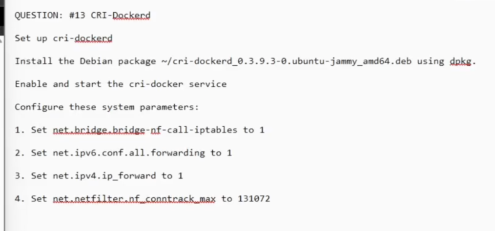

Install the cridocker .deb package using the dpkg -i command and perform some follow-up tasks.

https://www.youtube.com/watch?v=u3kUI9lFPWE

---

sudo dpkg -i ~/cri-dockerd_0.393-0ubuntu-jammy_amd64.deb

sudo systemctl enable --now cri-dockerd.service
sudo systemctl start cri-dockerd.service
sudo systemctl status cri-dockerd.service

vim /etc/sysctl.d/cka.conf

net.bridge.bridge-nf-call-iptables=1
net.ipv6.conf.all.forwarding=1
net.ipv4.ip_forward=1
net.netfilter.ng_conntrack_max=131072

sudo systemctl restart cri-dockerd.service
sudo systemctl status cri-dockerd.service