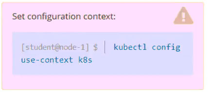

# Question 14

Task
From the pod label name=overloaded-cpu, find pods running high CPU workloads and write the name of the pod consuming most CPU to the file /opt/
KUTR00401/KUTR00401.txt (which already exists).

