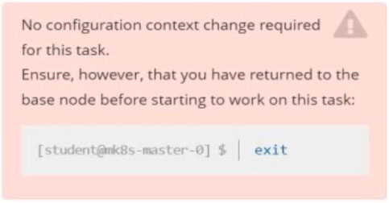
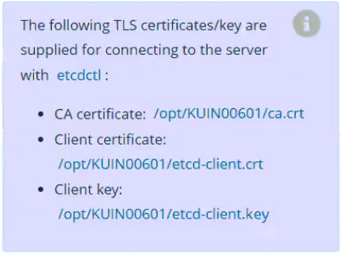
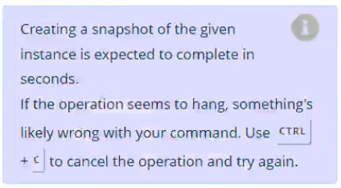

# Question 5

Task

First, create a snapshot of the existing etcd instance running at https://127.0.0.1:2379,

saving the snapshot to /var/lib/backup/etcd-snapshot.db.

Next, restore an existing, previous snapshot located at /var/lib/backup/etcd-snapshot-previous.db.

