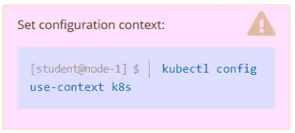

# Question 8

Task

Schedule a pod as follows:

✑ Name: nginx-kusc00401
✑ Image: nginx
✑ Node selector: disk=ssd

Notes:
- Search for nodeSelector
- click on "Labels and Selectors | Kubernetes" for example